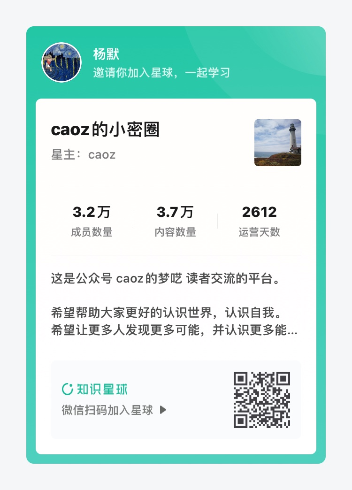

# URL：你是幸运的

## 关于书名

受到[一则经典技术面试题目的解读](http://mp.weixin.qq.com/s?__biz=MzI0MjA1Mjg2Ng==&amp;mid=209679438&amp;idx=1&amp;sn=d68c1512ad23f6e164f69bd351a18c62&amp;) 的启发，我想要彻底了解「从浏览器地址栏输入网址，到网页彻底打开，中间都发生了什么？」。

这个话题所涉及到的知识点纷繁复杂，绝不是简单的一篇文章就能总结清楚的。于是我想将其扩展成一本书。我为这本书取的英文名很简单，**URL**，它是 **Universal Resource Locator （统一资源定位地址）** 的缩写。但看到这三个字母，我还想到了 **You Are Lucky**，「你是幸运的」。

想来也是，这个世界从来就充满了战争和饥饿，和平与富足的生活从来都没有眷顾到所有人。因此，看到这些文字的你，和写下这些文字的我，我们都是幸运的。

关于书名的由来，大概就是这样了。

## 主要内容

本书的内容将会从上面提到的这则经典的面试题开始，带领读者一步步探索这个对我们来说既熟悉又陌生的网络世界。

这本书将会至少由中文、英文两种语言。

## 适合人群

我希望这本书适合所有人阅读。如果你觉得不合适，不妨继续读下去，说不定读着读着就觉得合适了呢。

## 作者的话

这将是我发行的第一本书。受到 Indie Hacker 文化的影响，这会是一个 Build in Public 的项目，所以我并不知道终点在哪，但我希望能够尽可能将这个项目完善。

这也是一个开源项目，如果读者有任何疑问，都可以在 GitHub 的 Issue 里提出来，我将会代表作者本人感谢你的贡献。

## 支持作者

如果想变得更加幸运，你可以通过以下行为支持作者：

1. 加入「caoz 的小密圈」这个知识星球，星主 caoz 即是公众号文章[一则经典技术面试题目的解读](http://mp.weixin.qq.com/s?__biz=MzI0MjA1Mjg2Ng==&amp;mid=209679438&amp;idx=1&amp;sn=d68c1512ad23f6e164f69bd351a18c62&amp;)的作者本人。我从 caoz 老师的文章和知识星球里收获到了很多，希望你也可以像我一样幸运。利益相关：使用我分享的二维码加入星球，你可以在知识星球内获得 ￥15 的返现，我也可以获得 ￥35 的赏金。

    

1. 直接参与本项目，通过在 Issue 里提问或者提交 Pull Request 对本书内容进行订正、补充。
